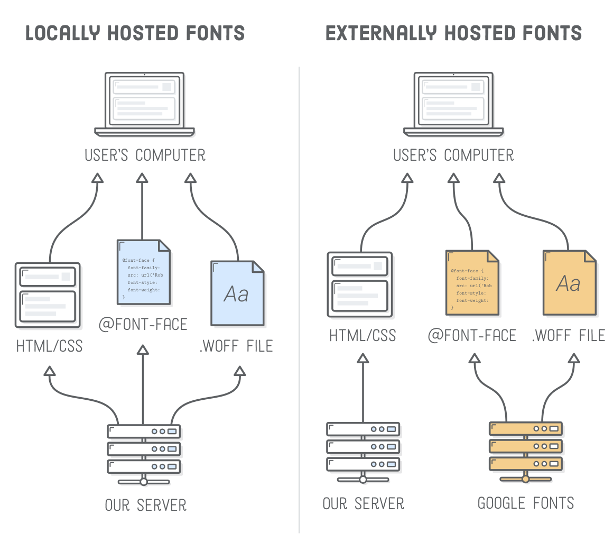

# 4 Tips for Starting Any New Website Project

Ignore styling the layout first; start simple with general rules like colors and typography

By focusing on typography and colors, you can use the built-in, default responsive features of block and inline behavior to create a really spiffy website.

1. See https://randoma11y.com for cool and accessible (high contrast ratios) color combos.
    * Define keyword variables for these fundamental colors on the `:root` element.
2. Use simple spacing and line-height rules to start with.
3. Define those general font-family and font-size rules.
    * Sizing: Typically use `rem` or `em` values
    * Families: Pick 2-3 fonts to use: serif for headings; sans-serif for copy content
4. Be sure to use comments for documentation

## [Internetingishard.com](https://www.internetingishard.com/html-and-css/web-typography/) (by Oliver James)

### Importing Local Fonts

### Importing External Fonts

### Font Weights and Styles

When importing fonts or defining typography scheme, use the range of weights and styles.

